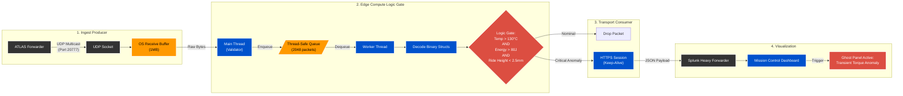

# **Project Apex: MCL40 Active Aero Validation Engine**


## **🏁 Executive Summary**

**Project Apex** is an edge-compute telemetry pipeline designed to bridge the correlation gap between 2026 F1 Power Unit simulations and trackside reality.

It pipelines high-frequency (60Hz) physical telemetry from the ATLAS forwarder directly into **Splunk Enterprise** via HEC to validate vehicle compliance in real-time. Its primary function is to detect **Transient Torque Anomalies**—unmapped torque spikes caused by PU thermal-kinematic transitions—that risk destabilizing the aerodynamic platform.

**Note on Data Source:** This architecture was designed around McLaren's ATLAS telemetry ecosystem but is compatible with any F1 data acquisition system broadcasting UDP telemetry on port 20777\. The struct format is configurable for any team's DAQ output schema.

## **🏎️ The Physics Problem (2026 Regulations)**

The 2026 Technical Regulations introduce two conflicting variables that threaten platform stability:

1. **The Thermal-Kinematic Transition:** The shift from 16:1 geometric compression (Ambient) to \~18:1 effective compression (at the 130°C FIA regulatory threshold) creates a **Transient Torque Gain** not present in standard static maps.  
2. **Hybrid Torque Conflict:** The 50/50 power split forces aggressive MGU-K deployment/harvesting events that can conflict with the ICE torque curve during "Lift & Coast" or "Corner Exit" phases.

**The Consequence:** Both scenarios result in **Unmapped Torque Anomalies** that mechanically compress the rear suspension (\~2.5mm squat), shifting the aerodynamic Center of Pressure (CoP) and risking a **diffuser stall**.

**Project Apex** acts as a deterministic logic gate. While primarily triggered by Thermal State (\>130°C), its **dual-signal validation** (Vertical Energy \+ Ride Height) confirms platform instability caused by either thermal expansion or hybrid integration conflicts, eliminating false positives from kerb strikes or track surface events.

## **⚙️ System Architecture (v2.1)**

To support 60Hz telemetry without packet loss on constrained edge hardware (Cisco IOx), the system utilizes a **Threaded Producer-Consumer** architecture.


``` mermaid
flowchart LR
    subgraph Trackside ["1. Ingest Producer"]
        ATLAS["ATLAS Forwarder"] -- "UDP Multicast\n(Port 20777)" --> Socket["UDP Socket"]
        Socket --> Buffer["OS Receive Buffer\n(1MB)"]
    end

    subgraph EdgeCompute ["2. Edge Compute Logic Gate"]
        Buffer -- "Raw Bytes" --> PyMain["Main Thread\n(Validator)"]
        PyMain -- "Enqueue" --> Queue[/"Thread-Safe Queue\n(2048 packets)"/]
        Queue -- "Dequeue" --> Worker["Worker Thread"]
        Worker --> Decode["Decode Binary Structs"]
        Decode --> LogicGate{"Logic Gate:\nTemp > 130°C\nAND\nEnergy > 80J\nAND\nRide Height < 2.5mm"}
    end

    subgraph TransportLayer ["3. Transport Consumer"]
        LogicGate -- "Nominal" --> Drop["Drop Packet"]
        LogicGate -- "Critical Anomaly" --> Session["HTTPS Session\n(Keep-Alive)"]
    end

    subgraph Visualization ["4. Visualization"]
        Session -- "JSON Payload" --> Splunk["Splunk Heavy Forwarder"]
        Splunk --> Dashboard["Mission Control Dashboard"]
        Dashboard -- "Trigger" --> GhostPanel["Ghost Panel Active:\nTransient Torque Anomaly"]
    end

    classDef source fill:#333,stroke:#fff,stroke-width:2px,color:#fff;
    classDef process fill:#0052cc,stroke:#fff,stroke-width:2px,color:#fff;
    classDef buffer fill:#ff9900,stroke:#fff,stroke-width:2px,color:#000;
    classDef alert fill:#DC4E41,stroke:#fff,stroke-width:2px,color:#fff;

    class ATLAS,Socket,Splunk source;
    class PyMain,Worker,Decode,Session,Dashboard process;
    class Buffer,Queue buffer;
    class LogicGate,GhostPanel alert;
```

### **🛡️ CISSP Security & Hardening**

As a deployment intended for critical race infrastructure, Project Apex enforces strict security and reliability controls:

1. **Zero Trust Architecture**  
   * **Signal Fidelity:** Single-source sensor data is not trusted. Ride Height (Laser) is cross-referenced against Vertical Acceleration (Accelerometer) to confirm the squat event before triggering a CRITICAL alert.  
   * **Air Gap Design:** The validator operates on the edge (Garage LAN) with no inbound connections. It pushes data out via HTTPS only, reducing the attack surface.  
2. **Input Validation & Sanitization**  
   * **Binary Struct Unpacking:** Raw UDP packets are parsed using strict C-style structs (\<d10sffff). Any packet matching an incorrect length or format is immediately dropped, preventing buffer overflow attacks or fuzzing crashes.  
3. **Memory Safety & Resource Management**  
   * **Tail-Drop Queuing:** The producer-consumer queue is bounded (2048 packets). If the Splunk receiver becomes unreachable, the system drops the oldest packets rather than consuming all available RAM, preventing OOM crashes.  
   * **Log Rate Limiting:** Error logs are throttled to prevent disk exhaustion on edge hardware during network outages.  
4. **Credential Management**  
   * **No Hardcoded Secrets:** Splunk HEC tokens are injected strictly via OS Environment Variables (os.getenv).  
   * **Default Token Gate:** If SPLUNK\_TOKEN is not configured, the service logs a security warning and halts transmission—preventing accidental data exfiltration.  
   * **SSL:** Configurable CA bundle path for self-signed certificates in air-gapped garage environments. Encryption in transit is enforced in all deployment modes.

### **🧠 Validation Logic**

The core logic uses dual-signal validation to correlate thermal state with suspension dynamics. Both a vertical energy spike AND a ride height depression must be present to trigger a CRITICAL alert, eliminating false positives from kerb strikes.

```python
# Project Apex Logic Gate (v2.1)  
# Named constants — no magic numbers  
THERMAL\_THRESHOLD\_C \= 130.0      # FIA 130°C operating threshold  
THERMAL\_ENERGY\_LIMIT\_J \= 80.0    # Reduced limit when floor is thermally loaded  
ENERGY\_LIMIT\_J \= 100.0           # Standard FIA vertical oscillation limit  
SQUAT\_THRESHOLD\_MM \= 2.5         # Rear suspension squat threshold (Project Apex V2 thesis)

if engine\_temp \> THERMAL\_THRESHOLD\_C:  
    thermal\_mode \= "HIGH\_COMPRESSION"  \# Effective \~18:1 compression active  
      
    \# Dual-signal validation: energy spike \+ ride height depression must both confirm  
    squat\_detected \= ride\_height \< SQUAT\_THRESHOLD\_MM  
    if energy\_joules \> THERMAL\_ENERGY\_LIMIT\_J and squat\_detected:  
        compliance\_status \= "CRITICAL: TORQUE\_ANOMALY\_CONFIRMED"  
    elif energy\_joules \> THERMAL\_ENERGY\_LIMIT\_J:  
        compliance\_status \= "WARNING: TORQUE\_ANOMALY\_UNCONFIRMED"  
elif energy\_joules \> ENERGY\_LIMIT\_J:  
    compliance\_status \= "VIOLATION\_RISK"
```

## **🚀 Deployment Guide (MTC/Trackside)**

### **Prerequisites**

* Docker installed (for Edge deployment) or Python 3.10+ (for local testing)  
* Network Access to Garage LAN (UDP 20777\)  
* Splunk HEC Token (Administrator Access)

### **🐳 Production Edge Deployment (Docker / Cisco IOx)**

Project Apex is fully containerized for rapid deployment to trackside edge-compute nodes (e.g., Cisco Catalyst hardware running IOx) in restricted garage environments.

1. **Build the Docker Image:**

```docker build \-t project-apex-edge .```

**2\. Run the Container:**

```
docker run \--rm \-it \\  
  \-p 20777:20777/udp \\  
  \-e SPLUNK\_HEC\_URL="\[https://splunk-hec.mclaren.internal:8088/services/collector/event\](https://splunk-hec.mclaren.internal:8088/services/collector/event)" \\  
  \-e SPLUNK\_TOKEN="your\_secure\_token" \\  
  project-apex-edge
```

**Note for Cisco IOx environments:** After building the Docker image locally, use the ioxclient CLI tool to package the image into a .tar file for direct deployment via the Cisco Local Manager to the trackside Catalyst edge nodes.

### **💻 Local Testing (Python)**

If testing locally without Docker:

\# 1\. Clone the Repo    
```
git clone \[https://github.com/SecurityCyberGeek/project-apex-telemetry.git\](https://github.com/SecurityCyberGeek/project-apex-telemetry.git)  
cd project-apex-telemetry
```

\# 2\. Set Environment Variables (CISSP Standard: No Hardcoded Tokens)    
```
export SPLUNK\_HEC\_URL="\[https://splunk-hec.mclaren.internal:8088/services/collector/event\](https://splunk-hec.mclaren.internal:8088/services/collector/event)"  
export SPLUNK\_TOKEN="\[SECURE\_INJECTED\_TOKEN\]"  
export LISTEN\_PORT=20777
```

\# 3\. Run the Validator    
```python3 production\_validator\_service\_prod.py```

### **Verification**

Monitor the console logs to confirm the handshake:

* **Initialization:** `[\*\] Project Apex Validator Active on 0.0.0.0:20777`  
* **Logic Check:** `[\*\] Logic Profile: MCL40\_TRANSIENT\_TORQUE\_V2`  
* **Heartbeat:** `[INFO\] SUCCESS \-\> Splunk Ingestion Active (Heartbeat: 60s)`

## 📚 Operations Manual (SOP)

For detailed operational protocols, incident response playbooks, and the "Mercedes Loophole" physics breakdown, refer to the official documentation.

[**View Project Apex: MCL40 Operations Manual (v2.1) on Notion ↗**]([Project Apex Operational Manual](https://www.notion.so/Project-Apex-MCL40-Operations-Manual-3011300163bc80caaeabf7c81d3ab233?source=copy_link))

## **🎥 Concept Demonstration**

**Digital Twin Validation (Shadow Mode):** Watch the 90-second Tech Demo visualizing the oscillation logic in action.

[](https://youtu.be/4t1N5uW8Gqk)

## **👤 Author**

**Timothy D. Harmon, CISSP**

* **Role:** Lead Enterprise Architect | Cyber-Physical Telemetry (Proposed)  
* **Specialty:** Telemetry Data Analysis & Systems Security  
* **Credential:** Cisco Insider Champion | BMMC Marshal

*Built on the **Splunk Operational Intelligence** platform.*
