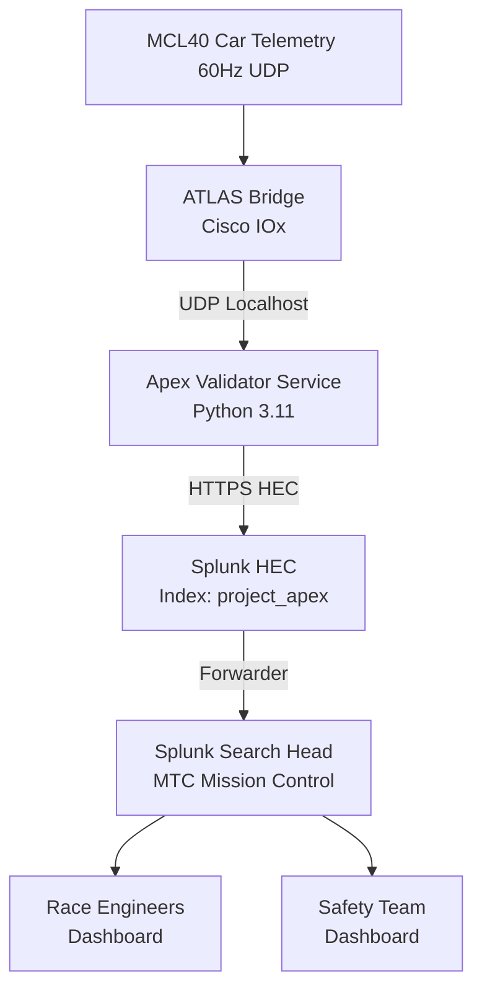

# **Project Apex: MCL40 Real-Time Physics Validation System**


## 🏁 What Is Project Apex?

**Project Apex** is a deployment-ready, real-time physics validation system for F1-style telemetry streams under the 2026 technical regulations.

It sits on a trackside edge node, listens to the same 60 Hz UDP telemetry feed as the team’s primary system (e.g., ATLAS), computes vertical energy from vertical velocity, classifies each packet’s physics state and integrity severity, and forwards enriched JSON events to Splunk Enterprise via HEC.

The v1.1 specification addresses three core gaps exposed during the opening races of the 2026 season:

1. **Unexpected power unit state transitions** — including battery-empty-to-surge events that current telemetry systems cannot predict (ref: Oscar Piastri, Melbourne 2026)
2. **Dynamic FIA regulatory boundaries** — energy deployment limits that change mid-weekend via Technical Directive (ref: Australian GP Friday → Saturday TD change)
3. **Customer team data opacity** — McLaren’s documented lack of Mercedes HPP transparency creates validation blind spots that independent physics validation addresses directly

Project Apex does not replace existing telemetry infrastructure. It adds an integrity layer that turns *“data is flowing “* into *“data is physics-validated, severity-tagged, and TD-compliant.”*

---

## 🧠 Physics Model (v1.1)

Apex v1.1 uses a deliberately grounded physics model derived from the 2026 FIA Technical
Regulations.

### Inputs per packet (binary struct `<d10sffff>`)

| Field | Type | Description |
|---|---|---|
| `timestamp` | double | Unix timestamp |
| `car_id` | 10-byte string | Car identifier |
| `speed_kph` | float | Vehicle speed |
| `front_ride_height_mm` | float | Front ride height |
| `vertical_velocity_ms` | float | Vertical velocity (Z-axis) |
| `engine_temp_c` | float | Power unit temperature |

### Derived metric: Vertical Energy

$$E = \frac{1}{2} \cdot m \cdot v_z^2$$

Where `m = 798.0 kg` (MCL40 minimum mass) and `v_z = vertical_velocity_ms`.

### Thresholds

```python
CAR_MASS_KG             = 798.0
THERMAL_THRESHOLD_C     = 130.0   # Above this: HIGH_COMPRESSION mode
ENERGY_LIMIT_J          = 100.0   # Standard oscillation limit
THERMAL_ENERGY_LIMIT_J  = 80.0    # Reduced limit when thermally loaded
AERO_STALL_RH_MM        = 28.0    # Rear ride height stall-risk threshold
```

### **Classification (per event):**
| Field | Values |
|---|---|
| `compliance_status` | LEGAL / VIOLATION_RISK / WARNING / CRITICAL |
| `thermal_mode` | STANDARD / HIGH_COMPRESSION |
| `apex_severity` | GREEN / YELLOW / RED |
| `apex_status` | WITHIN_SPEC / TRENDING / ANOMALY_DETECTED |
| `apex_message` | short human-readable description |
| `sensor_id` | currently `"VERT_PLATFORM"` |

### **Severity Levels and Actions**
| Severity | Condition | Apex Status | Action |
|---|---|---|---|
| GREEN | Energy < 100 J, Temp < 130°C | `WITHIN_SPEC` | Log Only |
| YELLOW | Energy >= 100 J OR Temp >= 130°C | `TRENDING` | Engineer Notification |
| RED | Energy >= 100 J + Temp >= 130°C + RH <= 28mm | `ANOMALY_DETECTED` | Immediate alert to race engineer and driver |

## **🧠 Validation Logic**

Apex v1.1 uses vertical energy, engine temperature, and rear ride height to classify each event. The logic below matches `production_validator_service_prod_2.py` exactly.

```python
CAR_MASS_KG             = 798.0
THERMAL_THRESHOLD_C     = 130.0   # Above this: HIGH_COMPRESSION
ENERGY_LIMIT_J          = 100.0   # Standard oscillation limit
THERMAL_ENERGY_LIMIT_J  = 80.0    # Reduced limit when thermally loaded
AERO_STALL_RH_MM        = 28.0    # Rear ride height stall-risk threshold

def calculate_vertical_energy(vz: float) -> float:
    return 0.5 * CAR_MASS_KG * (vz ** 2)

def classify_event(engine_temp: float, energy_joules: float, ride_height: float):
    compliance_status = "LEGAL"
    apex_severity = "GREEN"
    apex_status = "WITHIN_SPEC"
    apex_message = "Within expected physics envelope."
    thermal_mode = "STANDARD"
    squat_detected = False

    if engine_temp >= THERMAL_THRESHOLD_C:
        thermal_mode = "HIGH_COMPRESSION"
        squat_detected = (ride_height <= AERO_STALL_RH_MM)

        if energy_joules >= THERMAL_ENERGY_LIMIT_J and squat_detected:
            compliance_status = "CRITICAL"
            apex_severity = "RED"
            apex_status = "ANOMALY_DETECTED"
            apex_message = (
                “High engine temp, high vertical energy, and aero squat”
                “detected — torque anomaly."
            )
        elif energy_joules >= THERMAL_ENERGY_LIMIT_J:
            compliance_status = "WARNING"
            apex_severity = "YELLOW"
            apex_status = "TRENDING"
            apex_message = (
                “High engine temp and elevated vertical energy —”
                “monitor for torque anomaly."
            )
        elif engine_temp >= THERMAL_THRESHOLD_C:
            apex_severity = "YELLOW"
            apex_status = "TRENDING"
            apex_message = (
                “Engine temperature above nominal — monitor vertical energy”
                “and ride height."
            )
    else:
        if energy_joules >= ENERGY_LIMIT_J:
            compliance_status = "VIOLATION_RISK"
            apex_severity = "YELLOW"
            apex_status = "TRENDING"
            apex_message = (
                “Vertical energy above nominal limit — monitor for oscillation risk."
            )

    return compliance_status, apex_severity, apex_status, apex_message, thermal_mode
```

### 🆕 v1.1 New Validations
Battery State-of-Charge Monitoring (Post-Piastri)
Following the Oscar Piastri reconnaissance-lap incident at Melbourne 2026 — where a battery-empty condition produced an unexpected 100 kW surge on cold tyres — Apex v1.1 adds SOC as a classifier input:

```Python
def classify_event_v11(engine_temp, energy_joules, ride_height,
                       battery_soc, torque_actual, torque_expected):
    # Existing thermal/squat logic applies first...

    # Battery-empty surge detection
    if battery_soc <= 5.0 and (torque_actual - torque_expected) >= 80.0:
        return “CRITICAL”, “RED”, “ANOMALY_DETECTED”, \
               “Battery-empty unexpected torque surge detected — driver alert."

    # Recon-lap low-energy state
    if battery_soc <= 10.0 and ride_height <= 30.0:
        return “WARNING”, “YELLOW”, “TRENDING”, \
               “Low battery with reduced ride height — monitor for surge risk."
```

Expected vs. Actual Torque Differential
Apex monitors the delta between HPP-expected torque and actual delivered torque:
| **Delta** | **Severity** |
|---|---|
| ± 80 kW | YELLOW - `TRENDING` |
| ± 100 kW | RED - `ANOMALY_DETECTED` |

This directly addresses HPP data opacity: if the car delivers torque the manufacturer did not predict, Apex flags it regardless of what the manufacturer reports.

Power Reduction Rate Compliance
FIA 2026 regulations mandate that power reduction cannot exceed 50 kW/s. Apex monitors rate-of-change:

```Python
torque_rate_of_change = (torque_current - torque_previous) / delta_time

if abs(torque_rate_of_change) > 50000:  # 50 kW/s in watts
    return “VIOLATION_RISK”, “RED”, “ANOMALY_DETECTED”, \
           “Power reduction rate exceeds 50 kW/s FIA limit."
```

Superclipping vs. Lift-and-Coast Recovery Mode Differentiation
Apex v1.1 differentiates between two recovery scenarios and validates against the correct boundary for each:
| **Recovery Mode** | **Max Allowed** | **Trigger** |
|---|---|---|
| Superclipping | 250 kW | Partial throttle maintained |
| Lift-and-Coast | 350 kW | Full throttle lift detected |

## ⚡ FIA Technical Directive Dynamic Configuration

The Problem
At the 2026 Australian Grand Prix, the FIA issued a Technical Directive lowering qualifying recoverable energy from 8.5 MJ to 7.0 MJ between Friday practice and Saturday qualifying — then partially reversed it after team pushback. Hardcoded validation thresholds cannot handle mid-weekend regulatory flux.

Configuration Architecture
Apex v1.1 introduces a Technical Directive Configuration Layer:

```JSON
{
  “event”: “2026_Chinese_GP”,
  “session": “Qualifying”,
  "effective_timestamp": "2026-03-14T10:00:00Z",
  "energy_limits": {
    “max_recoverable_mj”: 7.0,
    “race_normal_mj”: 8.0,
    “race_overtake_mj”: 8.5,
    “outlap_practice_quali_mj”: 8.5
  },
  "power_reduction_limits": {
    “max_rate_kw_per_s”: 50.0
  },
  "recovery_modes": {
    “superclipping_max_kw”: 250.0,
    “lift_and_coast_max_kw”: 350.0
  }
}
```

Update Mechanism 
1. FIA publishes TD via official channels

2. Race engineer uploads TD JSON to Splunk lookup table

3. Apex Validator Service polls the lookup table every 60 seconds

4. New configuration applies to the next telemetry packet batch

Fallback: If TD configuration is unavailable, Apex defaults to the 2026 baseline
regulations (8.5 MJ recoverable).

Multi-Circuit Energy Harvest Profiles
Apex v1.1 includes pre-calculated energy harvest profiles for key 2026 circuits:
| **Circuit** | **Sustained Straight** | **Braking Zones** | **Apex Energy Strategy** |
|---|---|---|---|
| Melbourne | 1.4 km (Lakeside) | 4 major zones | High harvest variability |
| Shanghai | 1.7 km (T11-T14) | 3 major zones | Early depletion, sharp cliff |
| Suzuka | 1.1 km (T16-T17) | 5 major zones | Balanced recovery |
| Spa | 2.0 km (Kemmel) | 4 major zones | Longest sustained deployment |

## **⚙️ System Architecture (v1.1)**

Apex uses a threaded producer–consumer design to sustain 60 Hz telemetry on edge hardware.

- **Producer (main thread)**:
  - Binds a UDP socket (default 0.0.0.0:20777).
  - Receives raw packets from the telemetry forwarder.
  - Pushes packets into a bounded queue (maxsize=2048).

- **Consumer (worker thread)**:
  - Dequeues packets from the queue.
  - Validates packet length and unpacks the struct.
  - Computes vertical energy and classification.
  - Sends enriched JSON to Splunk HEC using a persistent HTTPS session.

- **Splunk side**:
  - Index: project_apex
  - Sourcetype: mcl_telemetry
  - Dashboard: **"Project Apex: Mission Control (MCL40)”**

Apex runs in parallel with your existing telemetry stack. It does not intercept or modify the primary ATLAS feed.

### Latency Budget
| **Stage** | **Target Latency** | **Measurement Point** |
|---|---|---|
| Telemetry emission | 16.7ms (60 Hz) | MCL40 -> UDP socket |
| ATLAS forwarding | <2ms | Bridge processing |
| Apex classification | <10ms | Validator compute |
| Splunk HEC Ingestion | <5ms | HTTP POST + ACK |
| Dashboard refresh | <1s | Search head UI |
| Total end-to-end | <1.5s | MCL40 -> Race Engineer screen |

> RED severity events trigger immediate push notification to the race engineer's mobile device, bypassing the dashboard refresh cycle.

### Hardware Requirements (Trackside Edge)
| **Component** | **Specification** |
|---|---|
| Platform | Cisco IR1101 Rugged Router or equivalent IOx-capable device |
| CPU | Minimum 4 cores, 2.0 GHz |
| RAM | 8 GB minimum, 16 GB recommended |
| Storage | 128 GB SSD |
| Network | Dual Ethernet (telemetry ingress & Splunk HEC egress) |
| Power | Redundant DC input (garage PDU + UPS backup) |

### Network VLAN Segmentation (Trackside)
| **VLAN** | **Purpose** | **Traffic** |
|---|---|---|
| VLAN 100 | Telemetry | MCL40 -> ATLAS Bridge (air-gapped, no internet) |
| VLAN 200 | Validator | ATLAS -> Apex Service -> Splunk HEC |
| VLAN 300 | Management | SSH access for service updates |

Encryption:

Splunk HEC traffic encrypted via TLS 1.3

MTC tunnel established via IPsec VPN or SD-WAN

Telemetry packets remain unencrypted on VLAN 100 (air-gapped)

Architecture Diagram (Mermaid)


``` mermaid
graph TD
    A[MCL40 Car Telemetry 60Hz UDP] --> B[ATLAS Bridge\nCisco IOx]
    B -->|UDP Localhost| C[Apex Validator Service\nPython 3.11]
    C -->|HTTPS HEC| D[Splunk HEC\nIndex: project_apex]
    D -->|Forwarder| E[Splunk Search Head\nMTC Mission Control]
    E --> F[Race Engineers\nDashboard]
    E --> G[Safety Team\nDashboard]
```
All GREEN, YELLOW, and RED events go to Splunk. The physics logic never silently drops nominal data; only queue overflow can drop packets, and Apex logs that condition.

### **🛡️ CISSP Security & Hardening**

v1.0 includes practical hardening suitable for race-critical environments.

1. Network & Process Safety
- Apex binds only to the configured LISTEN_IP and LISTEN_PORT.
- The packet queue (maxsize=2048) prevents unbounded memory growth.
- When the queue is full, Apex drops new packets and logs a warning at most every 5 seconds.
- The UDP receive buffer (SO_RCVBUF) is set to 1 MB to reduce packet loss during bursts.

2. Input Validation
- Apex enforces the exact struct size (PACKET_SIZE).
- If the packet length does not match, Apex discards it without attempting to unpack it.
- Apex decodes car_id using UTF‑8 with errors= “ignore” and strips null bytes.

3. Credential Management
- Apex reads SPLUNK_HEC_URL and SPLUNK_TOKEN from environment variables.
- The code never hard-codes secrets.
- If SPLUNK_TOKEN equals the placeholder "REPLACE_WITH_SECURE_TOKEN", Apex:
  - Logs a security warning (rate-limited).
  - Refuses to send any telemetry to HEC.

4. Logging & Resilience
- Apex uses Python logging with throttled heartbeats and error messages:
  - Success heartbeat: at most once every 60 seconds.
  - Error/connection warnings: at most once every 5 seconds.
- HTTPS calls use a short timeout (0.5 s) to avoid blocking the worker thread.
- A persistent requests.Session with keep-alive reduces TLS overhead.

### 📊 Splunk Mission Control Dashboard
The provided Dashboard Studio JSON defines the “Project Apex: Mission Control (MCL40)” dashboard.

Data Sources
- Event Stream (ds_EventStream)
```
  index="project_apex" sourcetype="mcl_telemetry"
  | table _time, car_id, sensor_id, speed_kph, vertical_energy, engine_temp_c, rear_rh_mm, compliance_status, apex_severity, apex_status, apex_message
  | sort - _time
```
- Platform Status (ds_PlatformStatus)
```
  index="project_apex" sourcetype="mcl_telemetry"
  | stats max(vertical_energy) as majorValue
```
- Speed Trace (ds_SpeedTrace)
```
  index="project_apex" sourcetype="mcl_telemetry"
  | timechart span=1s avg(speed_kph) by car_id
```
- Thermal Threat Scanner (ds_ThermalCheck)
```
  index="project_apex" sourcetype="mcl_telemetry"
  | stats max(engine_temp_c) as peak_temp max(vertical_energy) as peak_energy
  | where peak_temp > 130 AND peak_energy > 80
```
- Thermal Scatter (ds_ThermalScatter)
```
  index="project_apex" sourcetype="mcl_telemetry"
  | table engine_temp_c, rear_rh_mm
```
- Severity Summary (ds_SeveritySummary)
```
  index="project_apex" sourcetype="mcl_telemetry"
  | stats count(eval(apex_severity="RED")) as majorValue
```
This SPL avoids malformed eventstats expressions and uses only valid eval(...) inside `stats`.

Visualizations
- Aero Platform Status: Single value showing majorValue (max vertical_energy) with color thresholds.
- Integrity Severity Summary: Single value showing RED event count.
- Live Speed Telemetry: Timechart of avg(speed_kph) by car_id.
- Event Stream: Table with row background colors driven by apex_severity (GREEN / YELLOW / RED).
- Thermal Scatter: Scatter plot of engine_temp_c vs rear_rh_mm.

Time Control
A global time picker (input_GlobalTime) sets the real-time analysis window:
  - Default: rt-30s,rt
All searches use the same earliest and latest tokens.

## **🚀 Deployment Guide (MTC/Trackside)**

### **Prerequisites**

To run Apex v1.0, you need:

- Runtime
  - Python 3.10+ (for direct execution), or
  - Docker/container runtime (for edge deployment).
- Network
  - Access to the telemetry UDP stream (default port 20777).
  - Network reachability to Splunk HEC over HTTPS.
- Splunk
  - Splunk Enterprise with:
    - HTTP Event Collector (HEC) enabled.
    - Index project_apex created.
    - HEC token with write access to that index.

Edge hardware (e.g., Cisco Catalyst with IOx) is recommended but not required; any Linux host with sufficient CPU can run the validator.

### **Deployment**

Environment Variables
Set at minimum:
```bash
export SPLUNK_HEC_URL="https://<your-splunk-host>:8088/services/collector/event"
export SPLUNK_TOKEN="<your_hec_token>"
export LISTEN_IP="0.0.0.0"
export LISTEN_PORT= “20777"
```
Local Run (Python)
```bash
git clone https://github.com/SecurityCyberGeek/project-apex-telemetry.git
cd project-apex-telemetry

python3 production_validator_service_prod.py
```
You should see logs similar to:
  - Project Apex Validator Active on 0.0.0.0:20777
  - Logic Profile: MCL40_TRANSIENT_TORQUE_V2_WITH_SEVERITY
  - SUCCESS -> Splunk Ingestion Active (Heartbeat: 60s) | Last Car: <CAR_ID>

Containerized Deployment (Example)
```bash
docker build -t project-apex-edge .

docker run --rm -it \
  -p 20777:20777/udp \
  -e SPLUNK_HEC_URL="https://<your-splunk-host>:8088/services/collector/event" \
  -e SPLUNK_TOKEN="<your_hec_token>" \
  -e LISTEN_IP="0.0.0.0" \
  -e LISTEN_PORT="20777" \
  project-apex-edge
```
For Cisco IOx, you can package this image with ioxclient and deploy it to supported Catalyst platforms.

### **Verification**

Monitor the console logs to confirm that Apex is running and connected:

- **Initialization:**
```
  Project Apex Validator Active on 0.0.0.0:20777
  Architecture: Multi-Threaded Producer/Consumer (Queue: 2048)
  Logic Profile: MCL40_TRANSIENT_TORQUE_V2_WITH_SEVERITY
```

- **Heartbeat (Splunk HEC OK)**:
```
SUCCESS -> Splunk Ingestion Active (Heartbeat: 60s) | Last Car: <CAR_ID>
```
If you see repeated warnings about the Splunk token or HEC connection instead of the heartbeat, check `SPLUNK_HEC_URL / SPLUNK_TOKEN` and network reachability.

## 📚 Operations Manual (SOP)

For detailed operational procedures and incident response playbooks:

[**View Project Apex: MCL40 Operations Manual (v1.0) on Notion ↗**]([Project Apex Operational Manual](https://www.notion.so/Project-Apex-MCL40-Operations-Manual-3011300163bc80caaeabf7c81d3ab233?source=copy_link))

## **🎥 Concept Demonstration**

**Digital Twin Validation (Shadow Mode):** Watch the 90-second walkthrough of the dashboard and severity signaling:

[](https://youtu.be/4t1N5uW8Gqk)

## 📈 Roadmap (Future Features – Not in v1.0)
The following items are planned, but not implemented in this release:
- Multi-channel sensor correlation (torque, suspension, steering column vibration).
- Per-circuit baseline learning and multi-lap trajectory-based YELLOW alerts.
- Cryptographic sensor and edge attestation, plus replay detection.
- Inline gating of telemetry (APEX-WARN / APEX-HOLD flows) with human-in-the-loop release.
- ML-enhanced anomaly detection constrained by physics.

v1.0 focuses on robust, threshold-based physics validation with clear severity signaling.

## **👤 Author**

**Timothy D. Harmon, CISSP**

* Lead Enterprise Architect - Project Apex (Cyber-Physical Telemetry)
* Motorsport UK / BMMC / SMMC / IMSA / SCCA Official  
* Cisco Insider Champion | Cisco Insider Advocate (Rockstar)

*Project Apex runs on top of your existing telemetry ecosystem and uses **Splunk** as its operational intelligence backbone to give engineers a clear, physics-grounded integrity view at race speed.*
