# **Project Apex: MCL40 Active Aero Validation Engine**


## **🏁 Executive Summary**

**Project Apex** is an edge-compute telemetry pipeline designed to bridge the correlation gap between 2026 F1 Power Unit simulations and trackside reality.

It pipelines high-frequency (60Hz) physical telemetry from the **ATLAS** forwarder directly into **Splunk Enterprise** via HEC to validate vehicle compliance in real-time. Its primary function is to detect **Transient Torque Anomalies**—unmapped torque spikes caused by PU thermal expansion—that risk destabilizing the aerodynamic platform.

## **🏎️ The Physics Problem (2026 Regulations)**

While the 2026 Technical Regulations mandate a **16:1 geometric compression ratio**, thermal expansion at race temperatures (\~105°C) creates an effective ratio closer to **18:1**.

* **The Risk:** This "Thermal Delta" results in a **Transient Torque Gain** not present in standard homologated maps.  
* **The Consequence:** This unmapped torque mechanically compresses the rear suspension (\~2.5mm squat), shifting the aerodynamic Center of Pressure (CoP) rearward and risking a **diffuser stall** (porpoising).

**Project Apex** acts as a deterministic logic gate, correlating **Engine Temperature** with **Vertical Energy** to flag these anomalies before they violate the FIA's 100J oscillation limit.

## **⚙️ System Architecture (v2.1)**

To support 60Hz telemetry without packet loss on constrained edge hardware (Cisco IOx), the system utilizes a **Threaded Producer-Consumer** architecture.

``` mermaid
flowchart TD
    %% Subgraph for the External Data Source
    subgraph Trackside [1. Ingest Producer]
        direction TB
        ATLAS[ATLAS Forwarder] 
        -- UDP Multicast<br>Port 20777 --> Socket[UDP Socket]
        Socket --> Buffer[OS Receive Buffer<br>SO_RCVBUF: 1MB]
    end

    %% Subgraph for the Internal Logic within the Python Script
    subgraph EdgeCompute [2. Edge Compute Logic Gate]
        direction TB
        Buffer -- Raw Bytes --> PyMain[Main Thread:<br>production_validator_service_prod.py]
        PyMain -- Enqueue --> Queue[(Thread-Safe Queue)]
        Queue -- Dequeue --> Worker[Worker Thread]
        Worker --> Decode[Decode Binary Structs]
        Decode --> LogicGate{Logic Gate:<br>Temp > 105°C<br>AND<br>Energy > 100J}
    end

    %% Subgraph for the Transport Layer
    subgraph TransportLayer [3. Transport Consumer]
        LogicGate -- Nominal --> Drop[Drop Packet]
        LogicGate -- Critical Anomaly --> Session[Persistent HTTPS Session<br>TCP Keep-Alive]
    end

    %% Subgraph for Visualization
    subgraph Visualization [4. Visualization]
        Session -- JSON Payload --> Splunk[Splunk Heavy Forwarder]
        Splunk --> Dashboard[Mission Control Dashboard]
        Dashboard -- Trigger --> GhostPanel[Ghost Panel Active:<br>Transient Torque Anomaly]
    end

    %% Styling for "Executive/Dark Mode" Look
    classDef source fill:#333,stroke:#fff,stroke-width:2px,color:#fff;
    classDef process fill:#0052cc,stroke:#fff,stroke-width:2px,color:#fff;
    classDef buffer fill:#ff9900,stroke:#fff,stroke-width:2px,color:#000;
    classDef alert fill:#DC4E41,stroke:#fff,stroke-width:2px,color:#fff;

    class ATLAS,Socket,Splunk source;
    class PyMain,Worker,Decode,Session,Dashboard process;
    class Buffer,Queue buffer;
    class LogicGate,GhostPanel alert;
```



## **🛡️ CISSP Security & Hardening**

As a deployment intended for critical race infrastructure, Project Apex enforces strict security and reliability controls:

### **1\. Zero Trust Architecture**

* **Signal Fidelity:** We do not trust single-source sensor data. Ride Height (Laser) is cross-referenced against Vertical Acceleration (Accelerometer) to validate the "Squat" event.  
* **Air Gap Design:** The validator operates on the edge (Garage LAN) with **no inbound connections**. It pushes data out via HTTPS only, reducing the attack surface.

### **2\. Input Validation & Sanitization**

* **Binary Struct Unpacking:** Raw UDP packets are parsed using strict C-style structs (\<d10sffff). Any packet matching an incorrect length or format is immediately dropped, preventing buffer overflow attacks or fuzzing crashes.

### **3\. Memory Safety & Resource Management**

* **Tail-Drop Queuing:** The producer-consumer queue is bounded (2048 packets). If the Splunk receiver becomes unreachable, the system drops the oldest packets rather than consuming all available RAM (preventing OOM crashes).  
* **Log Rate Limiting:** Error logs are throttled to prevent disk exhaustion on the edge device during network outages.

### **4\. Credential Management**

* **No Hardcoded Secrets:** Splunk HEC tokens are injected strictly via OS Environment Variables (os.getenv).  
* **SSL Verification:** Configurable to support self-signed certificates in air-gapped environments (verify=False) while maintaining encryption in transit.

## **🧠 Validation Logic**

The core logic correlates the thermal state with suspension dynamics to identify "Torque-Induced Squat."

```python
# Project Apex Logic Gate  
THERMAL\_THRESHOLD\_C \= 105.0   
ENERGY\_LIMIT\_J \= 80.0 \# Lower threshold when floor is choked

if engine\_temp \> THERMAL\_THRESHOLD\_C:  
    # Thermal Expansion State Detected (Effective 18:1)  
    thermal\_mode \= "HIGH\_COMPRESSION"  
      
    # If the car oscillates while in this state, it is a Torque Anomaly  
    if energy\_joules \> ENERGY\_LIMIT\_J:  
        compliance\_status \= "CRITICAL: TORQUE\_ANOMALY"
```

## **🚀 Deployment Guide (MTC/Trackside)**

### **Prerequisites**

* Python 3.10+ (Docker/Linux)  
* Network Access to Garage LAN (UDP 20777\)  
* Splunk HEC Token (Administrator Access)

### **Quick Start**
```python
\# 1\. Clone the Repo  
git clone \[https://github.com/SecurityCyberGeek/project-apex-telemetry.git\](https://github.com/SecurityCyberGeek/project-apex-telemetry.git)

\# 2\. Set Environment Variables (CISSP Standard: No Hardcoded Tokens)  
export SPLUNK\_HEC\_URL="\[https://splunk-hec.mclaren.internal:8088/services/collector/event\](https://splunk-hec.mclaren.internal:8088/services/collector/event)"  
export SPLUNK\_TOKEN="\[SECURE\_INJECTED\_TOKEN\]"  
export LISTEN\_PORT=20777

\# 3\. Run the Validator  
python3 src/production\_validator\_service\_prod.py
```
### **Verification**

Monitor the console logs to confirm the handshake:

* **Initialization:** `[\*\] Project Apex Validator Active on 0.0.0.0:20777`  
* **Logic Check:** `[\*\] Logic Profile: MCL40\_TRANSIENT\_TORQUE\_V2`  
* **Heartbeat:** `[INFO\] SUCCESS \-\> Splunk Ingestion Active (Heartbeat: 60s)`

## 📚 Operations Manual (SOP)

For detailed operational protocols, incident response playbooks, and the "Mercedes Loophole" physics breakdown, refer to the official documentation.

[**View Project Apex: MCL40 Operations Manual (v2.1) on Notion ↗**]([Project Apex Operational Manual](https://www.notion.so/Project-Apex-MCL40-Operations-Manual-3011300163bc80caaeabf7c81d3ab233?source=copy_link))

## **🎥 Concept Demonstration**

**Digital Twin Validation (Shadow Mode):** Watch the 90-second Tech Demo visualizing the oscillation logic in action.

[](https://youtu.be/4t1N5uW8Gqk)

## **👤 Author**

**Timothy D. Harmon, CISSP**

* **Role:** Senior Active Aero Validation Engineer (Proposed)  
* **Specialty:** Telemetry Data Analysis & Systems Security  
* **Credential:** Cisco Insider Champion | BMMC Marshal

*Built on the **Splunk Operational Intelligence** platform.*
